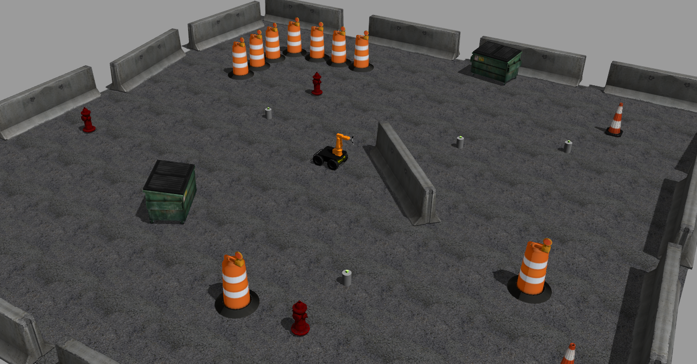

# Mobility Plus Manipulation


## Goal

In this session you'll use the ROS packages and algorithms you've learned this week (SLAM, navigation and manipulation), to program a simulated robot to perform a task:  
Navigating between a set of waypoints and collecting objects of interest.

## Prerequisites
In order to implement the mobile manipulation functionality, you will need the [manipulation](https://github.com/ros-workshop/manipulation) and [slam_navigation](https://github.com/ros-workshop/slam-navigation) repositories in working order.
Don't worry if you didn't get a final outcome for manipulation.
You will also need the [ABB](https://github.com/ros-industrial/abb) repository downloaded into your workspace.
After you `git clone` the repository, make sure you switch to the `kinetic-devel` branch.
It has been changed to allow for building on Noetic.


## Task Description

You'll be using the Husky with ABB arm mounted on it in order to achieve mobile manipulation. You have two tasks:

+ Create Launch files for running everything required.
+ modify this [script](./mobility-plus-manipulation/scripts/planner.py) to execute the mobile manipulaiton task.


## How this all comes together

### Manipulation

This session uses different simulated hardware from yesterday. Instead of the UR5, we will be using an ABB IRB120 arm mounted on a husky robot. 

You will not need any of the manipulation functionilty as it is already implemented for you [here](././mobile_manipulation/ws_husky_abb_manipulation/husky_abb_manipulation/src/husky_abb_grab_object.cpp). You are more than welcome to change that functionality if you want. However, you will need the dependencies installed in for that repo.

### Spawn Additional Cubes

Find the file that will spawn multiple stands and apriltags

### Initialise gmapping and move_base

This is following the week 2 day 2 tutorial https://github.com/ros-workshop/slam-navigation.

Will be using amcl this time:

`roslaunch mobility-plus-manipulation move_base_map_server_amcl.launch`

### Begin implementing the functionality

**Action**

Create a launch file to do the following:

```
mobility-plus-manipulation/husky_abb.launch

mobility-plus-manipulation/move_base_map_server_amcl.launch

husky_abb_moveit_config/moveit_planning_execution_gazebo.launch

```

⚠️ **Note:** You will need to run the following command **manually** before you run the launch file `mobility-plus-manipulation husky_abb.launch`;

```
roscd mobility-plus-manipulation/scripts
source husky_abb_description.bash
```

This command makes sure the abb gets included with the robot description in the URDF.
Do not dedicate any brain power to determining why this file is needed and what it does.

You should see something like this:



**Action**

Create another launch file with the following

```

 <node name="planner" pkg="mobility-plus-manipulation" type="planner.py" output="screen" />
 <node name="transform_tag_frame" pkg="husky_abb_manipulation" type="transform_tag_frame"/>
 <node name="husky_abb_grab_object_node" pkg="husky_abb_manipulation" type="husky_abb_grab_object_node" output="screen"/>
```
and a parameter call `move_before_grasp` set to `true`.
Launch the file.


**Modify the planner**

**Action**
 modify the planner.py script to obtain the desired functionality. You will need to have `slam_navigation configured properly` 
Optionally, set `move_before_grasp` to `true` and see what it does.


**Known issues**
The physics in Gazebo might break down after picking up one or two cubes.

## Stretch Goal

### Description

Robotic tasks often require complex state machines where robots observe and execute actions depending on its current
state (think [Markovian assumption](https://en.wikipedia.org/wiki/Markov_property) :)), if not for all states. ROS
provides a state-machine system for this very purpose called [Smach](http://wiki.ros.org/smach), which you can 
use for handling state-machines in your system. 

### Goal

Do go through Smach tutorials and see how you can use it to perform the sequence of mobility and manipulation tasks
above.  

